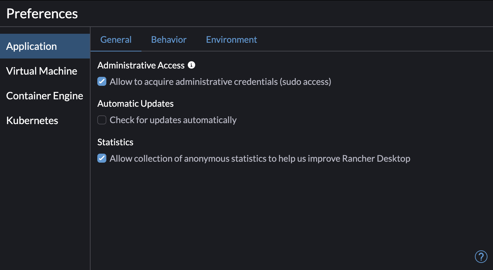
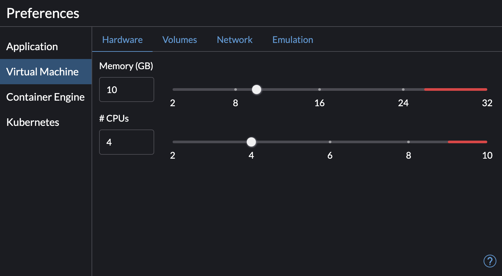
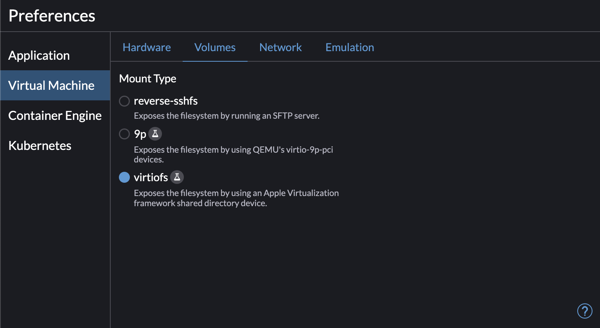
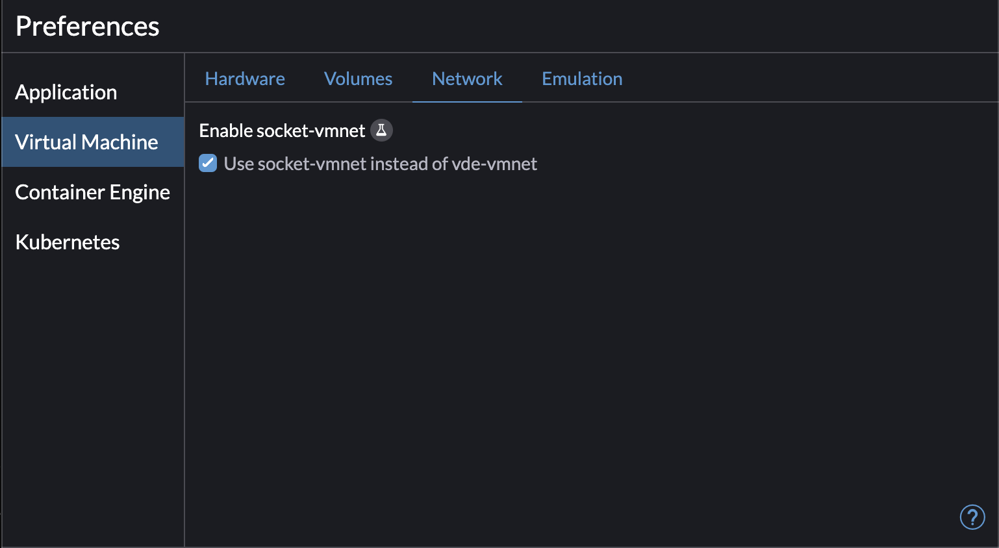
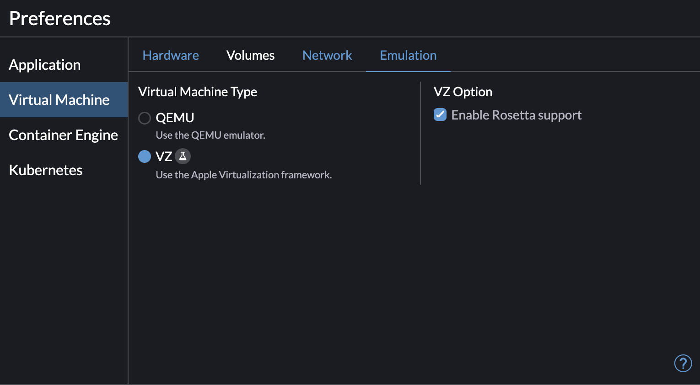
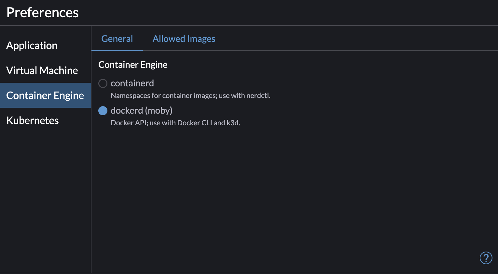
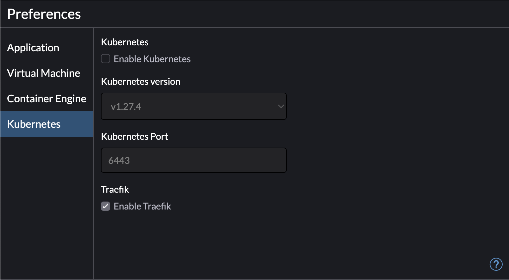

# Benötigte Tools

Folgende Tools müsst ihr installieren:

* [Docker](#Docker)
* [Azure CLI](https://learn.microsoft.com/de-de/cli/azure/install-azure-cli)
* Git

## Docker 

für diese Schulung wird Docker benötigt. Podman, Containerd usw. funktioniert nicht. Je nachdem welches Betriebssystem ihr habt, solltet ihr folgende Installationen vornehmen:

### Linux

Docker sollte nach dieser Anleitung installiert werden: https://docs.docker.com/engine/install/ubuntu/

### Windows (WSL2)

Für Windows wird die WSL2 benötigt: 

https://learn.microsoft.com/de-de/windows/wsl/install

Bitte prüft, ob ihr wirklich die WSL2 installiert habt:

```
wsl -l -v

   NAME         STATE       VERSION
*  Ubuntu       Running     2
```

Docker sollte nach dieser Anleitung installiert werden: https://docs.docker.com/engine/install/ubuntu/

Da die WSL2 kein systemd startet, muss der Docker Daemon über einen anderen Weg gestartet werden.
Hierzu fügt man folgenden Teil zur `.bashrc` bzw. `.zshrc` hin zu:

```
# Start Docker daemon automatically when logging in if not running.
RUNNING=`ps aux | grep dockerd | grep -v grep`
if [ -z "$RUNNING" ]; then
    sudo dockerd > /dev/null 2>&1 &
    disown
fi
```

### MacOS

Hier gibt es zwei Möglichkeiten:

#### Rancher Desktop

Hier sind die Links zu den aktuellen Rancher Desktop Files:

* [Apple Silicon](https://github.com/rancher-sandbox/rancher-desktop/releases/download/v1.12.1/Rancher.Desktop-1.12.1.aarch64.dmg)
* [Intel Macs](https://github.com/rancher-sandbox/rancher-desktop/releases/download/v1.12.1/Rancher.Desktop-1.12.1.x86_64.dmg)

 Hier ist wichtig, dass als Runtime Docker/Moby und nicht containerd ausgewählt wird. Bei Rancher Desktop soll auch der Kubernetes Cluster deaktiviert werden.

 Hier sind meine Einstellungen:

 
 
 
 
 
 
 


#### Docker Desktop
Hier wird eine Docker Desktop Lizenz benötigt. Diese muss über https://jambit.support beantragt werden. Es reicht aber Rancher Desktop vollkommen aus. Wenn ihr keine Lizenz für Docker habt, bitte deinstalliert es (ihr dürft es nicht verwenden!) und installiert Rancher Desktop.
Falls ihr schon eine gültige Lizenz habt, könnt ihr natürlich auch Docker Desktop verwenden.

https://www.docker.com/products/docker-desktop/

Der Kubernetes Cluster von Docker Desktop soll deaktiviert sein.